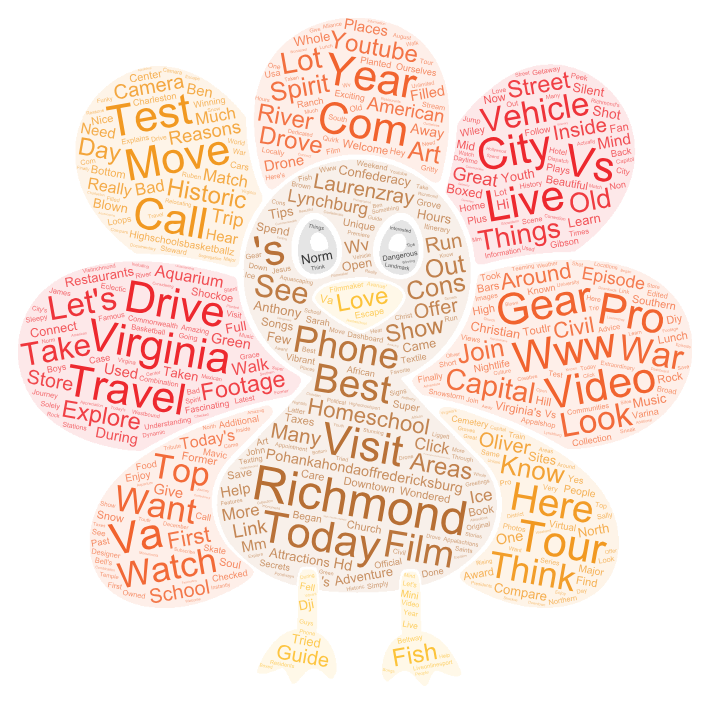

# 458_lab_2
## Bay Area, CA vs Richmond, VA

**i.**  I chose the areas of the Bay Area, CA and Richmond, VA. I landed on these two areas on youtube as it is a social media platform and will give me and idea of what is popular 
        and what current events are happening in the respective areas. 

**ii.** I wanted to make this comparison as I have grown up in the Bay Area and was curious as to the current events, or what was popular back home. I then branched out and decided to compare
        with Richmond, VA as there is a fair chance I move there post-grad due for work. I wanted to cross reference common words or phrases to see what would overlap to get a sense of how well
        I may fit into this new step in my life. 

**iii.** The largest difference that I found between the two word clouds was what seemed to be a gap in the interest in nature between the two areas. Richmond's word cloud was littered with     nature terms such as "Gear", "River", and "Travel". The Bay Area on the otherhand was more focused on media with terms large terms like "Video", "NFL", and a youtuber "Civryan". There were also a lot of similarities however, "Watch", "Show", and "Food".

**iv** I think that the reasons for the pattern is that the Bay Area is already known as and developed into a tech center where media and image are very important. It is also known as a common tourist destination due to San Francisco and San Jose. I see Richmond holding some of those similarities but to a lesser extent, I believe that Richmond is developing into this form of tech center but has not yet made the same leap as the Bay Area, hence why wer see similarities but also many differences.

**v** My research could be improved by having more direct comparisons in terms of sizing as well as collecting more data. This research was done comparing a complete area to a single city, which is not a fair or accurate comparison. 

**vi** Nothing stand out to me as incredibly different that expected other than the youtuber in the Bay Area. This however could be due to this individual posting many videos labeling as "Bay Area"

[Download Bay Area, CA Search Data (CSV)](bay-area-1-search.csv)

<a href="https://github.com/Jason-Simi/458_lab_2/raw/main/richmond-virginia-2-search.csv" download>Download Richmond, Virginia Search Data (CSV)</a>
